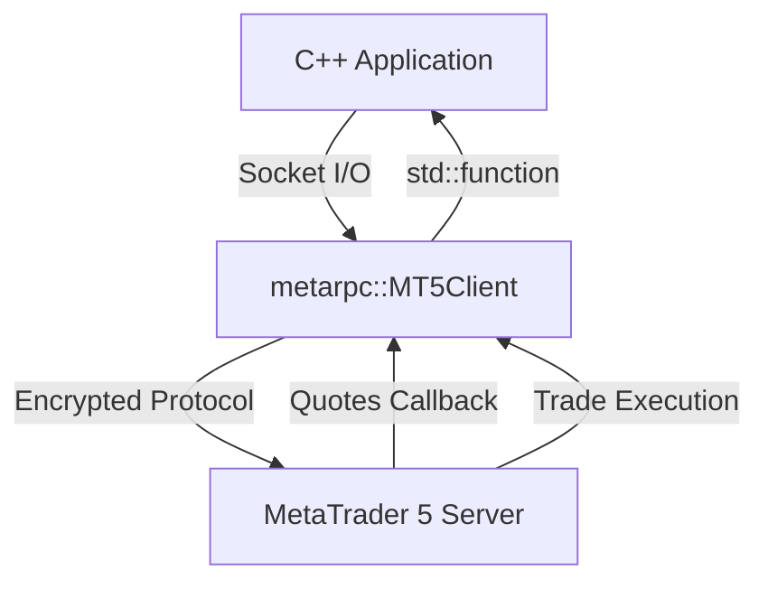

# CppMT5 SDK

Welcome to the **CppMT5 SDK** documentation. This high-performance, low-latency C++ library enables direct connection to MetaTrader 5 servers without requiring a local MT5 desktop terminal or Wine.

## Key Features

- **Ultra Low Latency**: Native C++ socket communication with direct binary protocol serialization.
- **Cross-Platform**: Compiles cleanly with GCC, Clang, and MSVC across Linux, macOS, and Windows.
- **Modern C++ Interface**: Native RAII, strongly typed enums, and standard library integration.
- **Complete Order Lifecycle**: Market execution, pending limit/stop orders, SL/TP trailing/updates, and closing.

## Architecture



## Quick Installation

### CMake Integration

```cmake
include(FetchContent)
FetchContent_Declare(
    metarpc_cppmt5
    GIT_REPOSITORY https://github.com/MetaRPC/CppMT5.git
    GIT_TAG        main
)
FetchContent_MakeAvailable(metarpc_cppmt5)

target_link_libraries(your_app PRIVATE metarpc_cppmt5)
```

See [Getting Started](getting-started.md) to build your first program.
